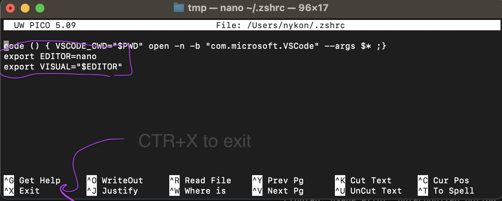

# Automatic script execution

## Cron-what?

Crontab is what the system is called.  
Cron job is what we add.

## Precondition

### Set nano as your default editor

1. Open terminal, type `sudo nano ~/.zshrc` and enter password
2. Add these two lines to the end of the file:
```
export EDITOR=nano
export VISUAL="$EDITOR"
```
3. Close `CTRL+X` and save `y`



$${\color{red}You need to close and reopen Terminal completely so the change takes effect!}$$

## Setting up a cron job on Mac

### Testing cron

Check out this simple [Python script that creates a file and adds a new line of text to it](./crontab-test.py).
We want to make it run every minute - automatically.


#### Save the script
Copy the script to anywhere on your computer.  
Write down the absolute path to this file, like  
```
/Users/nykon/Development/python/folksonomy/crontab-test.py
```

#### Create a cron job
This one is just as easy - we only need to add a single line to crontab!

1. Open Terminal
2. Enter `crontab -e` to see a probably empty screen
3. Add this line (update your local path to `.py` file)
```
*/1 * * * * /usr/local/bin/python3 /Users/nykon/Development/python/folksonomy/crontab-test.py
```
4. Save and close the file by typing `CTR+X` and confirm saving with `y`
5. Show all active cron jobs with `crontab -l`

#### Dissecting the cron job
`*/1 * * * *` This means run it `every minute`
`/usr/local/bin/python3` Tell cron where to find `Python`
`/Users/nykon/../crontab-test.py` Tell cron where to find `your script`  
As you see we always use absolute paths for cronjobs!

#### Does it really run?

You can either go to `cd /var/tmp` and check if the file exists or 
just type `cat /var/tmp/cronjob-result.txt` to list its content.
 
And that's it ☺️ Well, almost. DON'T FORGET TO DELETE THE CRONJOB AGAIN otherwise it will run forever. 
`crontab -e`, delete the line, save.

### Run performance tests

$${\color{yellow}Only continue if you refactored the script to read the URL from command line!}$$

1. Open Terminal
2. Enter `crontab -e` to see a probably empty screen
3. Add an entry for each domain:
   1. Add `* 0 10 * * /usr/local/bin/python3 /Users/monika/.../script.py www.dental21.de`
   2. Add `* 0 10 * * /usr/local/bin/python3 /Users/monika/.../script.py www.patient21.com`
4. Save and close the file by typing `CTR+X` and confirm saving with `y`
5. Show all active cron jobs with `crontab -l`

## Read more
https://betterprogramming.pub/how-to-execute-a-cron-job-on-mac-with-crontab-b2decf2968eb